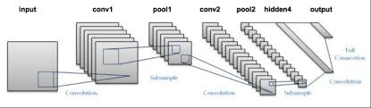
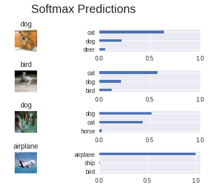

# Project: Image Classification

# Table of Contents
- [Project Description](#project-description)
- [Environment and Programming language](#environment-and-programming-language)
- [Data Description](#data-description)
- [Exploratory Data Analysis](#exploratory-data-analysis)
  * [Reading the Data](#reading-the-data)
  * [Data Exploration](#data-exploration)
- [Data Pre-processing](#data-pre-processing)
  * [Data Normalization](#data-normalization)
  * [One-hot encode](#one-hot-encode)
  * [Randomize the Data](#randomize-the-data)
  * [Pre-process the data and save it](#pre-process-the-data-and-save-it)
- [Build the Network](#build-the-network)
  * [Input](#input)
  * [Convolution and Max Pooling Layer](#convolution-and-max-pooling-layer)
  * [Flatten Layer](#flatten-layer)
  * [Fully-Connected Layer](#fully-connected-layer)
  * [Output Layer](#output-layer)
  * [Create Convolutional Model](#create-convolutional-model)
- [Train the Neural Network](#train-the-neural-network)
  * [Hyperparameters](#hyperparameters)
  * [Train on a Single CIFAR-10 Batch](#train-on-a-single-cifar-10-batch)
  * [Fully Train the Model](#fully-train-the-model)
- [Test Model](#test-model)
- [Further Improvements](#further-improvements)

## Project Description
In this project, we will classify images from the [CIFAR-10 dataset](https://www.cs.toronto.edu/~kriz/cifar.html).  The dataset consists of airplanes, dogs, cats, and other objects. We'll pre-process the images, then train a convolutional neural network on all the samples. The images need to be normalized and the labels need to be one-hot encoded.  We'll build a convolutional, max pooling, dropout, and fully connected layers.  At the end, we'll get to see your neural network's predictions on the sample images.

## Environment and Programming language
* Goggle Colab was used to work on this project as GPU is required to train the network.
* Python 3.6.7 has been used in Colab.
* Use `!pip list` to see all installed packages version in colab.
* We are going to use 2 helper files [problem_unittests.py](./problem_unittests.py) and [helper.py](./helper.py) files respectively during this project.
* Tensorflow framework is used for training the Convolutional Neural Network (CNN) for image classification.

## Data Description
[CIFAR-10 dataset](https://www.cs.toronto.edu/~kriz/cifar.html) is used. The dataset consists of airplanes, dogs, cats, and other objects.

## Exploratory Data Analysis
### Reading the Data
I used `urlretrieve()` function from `urllib.request` to download the data. Data is a tarball file and needed extraction. I used `tarfile.open()` to open the file with name **tar** and then used `tar.extractall()` function to extract the content of the archive file.

Then `test_folder_path()` function from `problem_unittests.py` helper file has been used to verify whether data has been downloaded and extracted properly or not.

### Data Exploration
The dataset is broken into batches to prevent machine from running out of memory.  The CIFAR-10 dataset consists of 5 batches, named `data_batch_1`, `data_batch_2`, etc.. Each batch contains the labels and images that are one of the following:
* airplane
* automobile
* bird
* cat
* deer
* dog
* frog
* horse
* ship
* truck

Following is the output from one of the batch.

* Samples: 10000
* Label Counts: {0: 1005, 1: 974, 2: 1032, 3: 1016, 4: 999, 5: 937, 6: 1030, 7: 1001, 8: 1025, 9: 981}
* First 20 Labels: [6, 9, 9, 4, 1, 1, 2, 7, 8, 3, 4, 7, 7, 2, 9, 9, 9, 3, 2, 6]

We have following one sample image from the data:


We have following parameters related to image extracted by the `display_stats()` function of `helper.py`:

* Image pixel values - Min Value: 0 Max Value: 252
* Image - Shape: (32, 32, 3)
* Label - Label Id: 1 Name: automobile

## Data Pre-processing
### Data Normalization
Function `normalize(x)` is used to normalize the image data so that values should be in the range of 0 and 1 both inclusive. This returns a numpy array of same size as of original image.

Function `test_normalize()` from `problem_unittests.py` to test if normalization process is properly done or not.

### One-hot encode
One hot encoding is required to convert output class variable to one hot encoded numpy array. Function `one_hot_encode(x)` is used for this which in turn uses `LabelBinarizer()` from `sklearn.preprocessing` module.

The one-hot encoding function should return the same encoding for each value between each call to `one_hot_encode`.  So I saved the map of encodings outside the function.

### Randomize the Data
Data can be randomized again but we are not doing it again because data has already been randomized.

### Pre-process the data and save it
`preprocess_and_save_data()` function from the `helper.py` file takes the original data and normalize and one hot encode the outcome variable and save the data to the disk so that this can work as the checkpoint and model building can be started directly with the pre-processed data.

Same data can be loaded back to work on.

`pickle.dump()` and `pickle.load()` function from **pickle** module were used to save and load data respectively.

## Build the Network
For the neural network, we'll build each layer into a function. We can use tensorflow provided function or can build our own function. We will go ahead with building our own function to implement layers in CNN.

Following is the implementation of various layers functions:

### Input
The neural network needs to read the image data, one-hot encoded labels, and dropout keep probability. I have implemented following functions:

* Implement `neural_net_image_input`
 * Return a [TF Placeholder](https://www.tensorflow.org/api_docs/python/tf/placeholder)
 * Set the shape using `image_shape` with batch size set to `None`.
 * Name the TensorFlow placeholder "x" using the TensorFlow `name` parameter in the [TF Placeholder](https://www.tensorflow.org/api_docs/python/tf/placeholder).
* Implement `neural_net_label_input`
 * Return a [TF Placeholder](https://www.tensorflow.org/api_docs/python/tf/placeholder)
 * Set the shape using `n_classes` with batch size set to `None`.
 * Name the TensorFlow placeholder "y" using the TensorFlow `name` parameter in the [TF Placeholder](https://www.tensorflow.org/api_docs/python/tf/placeholder).
* Implement `neural_net_keep_prob_input`
 * Return a [TF Placeholder](https://www.tensorflow.org/api_docs/python/tf/placeholder) for dropout keep probability.
 * Name the TensorFlow placeholder "keep_prob" using the TensorFlow `name` parameter in the [TF Placeholder](https://www.tensorflow.org/api_docs/python/tf/placeholder).

These names will be used at the end of the project to load your saved model.

### Convolution and Max Pooling Layer
Convolution layers have a lot of success with images. For this, I have implemented the function `conv2d_maxpool` to apply convolution then max pooling:
* Create the weight and bias using `conv_ksize`, `conv_num_outputs` and the shape of `x_tensor`.
* Apply a convolution to `x_tensor` using weight and `conv_strides`.
 * I used **same padding**, but **valid padding** can also be used.
* Add bias
* Add a nonlinear activation to the convolution.
* Apply Max Pooling using `pool_ksize` and `pool_strides`.
 * I used **same padding**, but **valid padding** can also be used.

### Flatten Layer
Implement the `flatten` function to change the dimension of `x_tensor` from a 4-D tensor to a 2-D tensor.  The output should be the shape (*Batch Size*, *Flattened Image Size*).

### Fully-Connected Layer
Implement the `fully_conn` function to apply a fully connected layer to `x_tensor` with the shape (*Batch Size*, *num_outputs*).

### Output Layer
Implement the `output` function to apply a fully connected layer to `x_tensor` with the shape (*Batch Size*, *num_outputs*). Activation, softmax, or cross entropy should **not** be applied to this.

### Create Convolutional Model
Implement the function `conv_net` to create a convolutional neural network model. The function takes in a batch of images, `x`, and outputs logits.  I have used the layers created above to create this model:

Following is the example of a typical CNN(convolution neural network):



As shown in example architecture we can have following layers in a CNN:

* Input layer which is realized by a placeholder for image input by using function `neural_net_image_input`.
* One or more pairs of convolution and pooling layers realized by function `conv2d_maxpool` which takes placeholder for image input as one of its input.
* We can optionally have dropout layers after every pair of convolution and pooling layers which is realized by `tf.nn.dropout` function of tensorflow.
* Then we have fully connected layer shown as hidden layer in example architecture which is realized by first flattening the output of dropout layer by using `flatten` function and then using `fully_conn` function. We can have multiple fully connected layers and optional dropout layers after every fully connected layers.
* Finally we have output layer which is realized by `output` function.

**All of this has been implemented in the function `conv_net`.**

`conv_net` function returns logits which will be further used for optimization. We need to have cost and optimized so that cost will be minimize. Following is the implementation of the same:

* Cost: `cost = tf.reduce_mean(tf.nn.softmax_cross_entropy_with_logits(logits=logits, labels=y))`
* Optimizer: `optimizer = tf.train.AdamOptimizer().minimize(cost)`

We can also calculate the accuracy using following code:
```
correct_pred = tf.equal(tf.argmax(logits, 1), tf.argmax(y, 1))
accuracy = tf.reduce_mean(tf.cast(correct_pred, tf.float32), name='accuracy')
```

## Train the Neural Network
Function `train_neural_network(session, optimizer, keep_probability, feature_batch, label_batch)` has been defined for training the network which takes following inputs:
* session: Current TensorFlow session
* optimizer: TensorFlow optimizer function
* keep_probability: keep probability
* feature_batch: Batch of Numpy image data
* label_batch: Batch of Numpy label data

We also use function `print_stats(session, feature_batch, label_batch, cost, accuracy)` to print cost and accuracy at every epoch. Following are the inputs of this function:
* session: Current TensorFlow session
* feature_batch: Batch of Numpy image data
* label_batch: Batch of Numpy label data
* cost: TensorFlow cost function
* accuracy: TensorFlow accuracy function

Use a keep probability of `1.0` to calculate the loss and validation accuracy because we don't want to drop anything for calculating the loss and validation accuracy.

### Hyperparameters
We have following hyperparameters to set before training the network.
* Set `epochs` to the number of iterations until the network stops learning or start overfitting. One epoch is one round of forward and backward propagation over whole data.
* Set `batch_size` to the highest number that machine has memory for. This feeds the data in batches of the specified size instead of feeding whole data so that network can be fit on bigger data as well without running over the memory.
* Set `keep_probability` to the probability of keeping a node using dropout.

I have set following values for above mentioned hyperparameters.
```
epochs = 25
batch_size = 128
keep_probability = 0.8
```

### Train on a Single CIFAR-10 Batch
As we have 5 different batches of the data, so first I trained model on the first batch. Note that this batch is different than the hyperparameter `batch_size` and following is the outcome of the same:
```
Checking the Training on a Single Batch...
Epoch  1, CIFAR-10 Batch 1:  Loss:     2.0297 Validation Accuracy: 0.327400
Epoch  2, CIFAR-10 Batch 1:  Loss:     1.7437 Validation Accuracy: 0.438000
Epoch  3, CIFAR-10 Batch 1:  Loss:     1.5017 Validation Accuracy: 0.491600
Epoch  4, CIFAR-10 Batch 1:  Loss:     1.3031 Validation Accuracy: 0.513800
Epoch  5, CIFAR-10 Batch 1:  Loss:     1.1210 Validation Accuracy: 0.538800
Epoch  6, CIFAR-10 Batch 1:  Loss:     0.9728 Validation Accuracy: 0.542600
Epoch  7, CIFAR-10 Batch 1:  Loss:     0.8598 Validation Accuracy: 0.560200
Epoch  8, CIFAR-10 Batch 1:  Loss:     0.7754 Validation Accuracy: 0.557600
Epoch  9, CIFAR-10 Batch 1:  Loss:     0.7111 Validation Accuracy: 0.575000
Epoch 10, CIFAR-10 Batch 1:  Loss:     0.6800 Validation Accuracy: 0.583000
Epoch 11, CIFAR-10 Batch 1:  Loss:     0.5959 Validation Accuracy: 0.577400
Epoch 12, CIFAR-10 Batch 1:  Loss:     0.5264 Validation Accuracy: 0.587800
Epoch 13, CIFAR-10 Batch 1:  Loss:     0.5098 Validation Accuracy: 0.586400
Epoch 14, CIFAR-10 Batch 1:  Loss:     0.4458 Validation Accuracy: 0.587600
Epoch 15, CIFAR-10 Batch 1:  Loss:     0.4234 Validation Accuracy: 0.586800
Epoch 16, CIFAR-10 Batch 1:  Loss:     0.3410 Validation Accuracy: 0.584600
Epoch 17, CIFAR-10 Batch 1:  Loss:     0.3242 Validation Accuracy: 0.584600
Epoch 18, CIFAR-10 Batch 1:  Loss:     0.3471 Validation Accuracy: 0.556400
Epoch 19, CIFAR-10 Batch 1:  Loss:     0.2696 Validation Accuracy: 0.568400
Epoch 20, CIFAR-10 Batch 1:  Loss:     0.2573 Validation Accuracy: 0.594800
Epoch 21, CIFAR-10 Batch 1:  Loss:     0.2212 Validation Accuracy: 0.590000
Epoch 22, CIFAR-10 Batch 1:  Loss:     0.2173 Validation Accuracy: 0.587800
Epoch 23, CIFAR-10 Batch 1:  Loss:     0.1685 Validation Accuracy: 0.578600
Epoch 24, CIFAR-10 Batch 1:  Loss:     0.1998 Validation Accuracy: 0.585000
Epoch 25, CIFAR-10 Batch 1:  Loss:     0.1324 Validation Accuracy: 0.596800
```

We can see loss is kept on decreasing but validation accuracy increasing till epoch 12 and then kept on oscillating and I stopped at epoch 25 which gave around **0.596800** validation accuracy.

### Fully Train the Model
After getting good accuracy score on single batch, I trained model on all 5 batches. Following is the outcome:
```
Training...
Epoch  1, CIFAR-10 Batch 1:  Loss:     1.8251 Validation Accuracy: 0.354000
Epoch  1, CIFAR-10 Batch 2:  Loss:     1.5231 Validation Accuracy: 0.445000
Epoch  1, CIFAR-10 Batch 3:  Loss:     1.3877 Validation Accuracy: 0.483600
Epoch  1, CIFAR-10 Batch 4:  Loss:     1.4517 Validation Accuracy: 0.517600
Epoch  1, CIFAR-10 Batch 5:  Loss:     1.3370 Validation Accuracy: 0.513800
Epoch  2, CIFAR-10 Batch 1:  Loss:     1.3274 Validation Accuracy: 0.541000
Epoch  2, CIFAR-10 Batch 2:  Loss:     1.2341 Validation Accuracy: 0.546600
Epoch  2, CIFAR-10 Batch 3:  Loss:     1.1033 Validation Accuracy: 0.548800
Epoch  2, CIFAR-10 Batch 4:  Loss:     1.3379 Validation Accuracy: 0.561200
Epoch  2, CIFAR-10 Batch 5:  Loss:     1.1193 Validation Accuracy: 0.565000
Epoch  3, CIFAR-10 Batch 1:  Loss:     1.1723 Validation Accuracy: 0.568000
Epoch  3, CIFAR-10 Batch 2:  Loss:     1.0755 Validation Accuracy: 0.585400
Epoch  3, CIFAR-10 Batch 3:  Loss:     0.9903 Validation Accuracy: 0.575400
Epoch  3, CIFAR-10 Batch 4:  Loss:     1.1787 Validation Accuracy: 0.592800
Epoch  3, CIFAR-10 Batch 5:  Loss:     0.9981 Validation Accuracy: 0.586200
Epoch  4, CIFAR-10 Batch 1:  Loss:     1.1115 Validation Accuracy: 0.595200
Epoch  4, CIFAR-10 Batch 2:  Loss:     0.9549 Validation Accuracy: 0.603600
Epoch  4, CIFAR-10 Batch 3:  Loss:     0.9332 Validation Accuracy: 0.594400
Epoch  4, CIFAR-10 Batch 4:  Loss:     1.0248 Validation Accuracy: 0.614400
Epoch  4, CIFAR-10 Batch 5:  Loss:     0.8735 Validation Accuracy: 0.611200
Epoch  5, CIFAR-10 Batch 1:  Loss:     0.9882 Validation Accuracy: 0.597400
Epoch  5, CIFAR-10 Batch 2:  Loss:     0.8700 Validation Accuracy: 0.606200
Epoch  5, CIFAR-10 Batch 3:  Loss:     0.8879 Validation Accuracy: 0.610200
Epoch  5, CIFAR-10 Batch 4:  Loss:     0.9304 Validation Accuracy: 0.620000
Epoch  5, CIFAR-10 Batch 5:  Loss:     0.8341 Validation Accuracy: 0.632800
Epoch  6, CIFAR-10 Batch 1:  Loss:     0.8815 Validation Accuracy: 0.624800
Epoch  6, CIFAR-10 Batch 2:  Loss:     0.7704 Validation Accuracy: 0.620000
Epoch  6, CIFAR-10 Batch 3:  Loss:     0.8427 Validation Accuracy: 0.620800
Epoch  6, CIFAR-10 Batch 4:  Loss:     0.8376 Validation Accuracy: 0.630000
Epoch  6, CIFAR-10 Batch 5:  Loss:     0.7411 Validation Accuracy: 0.635400
Epoch  7, CIFAR-10 Batch 1:  Loss:     0.9019 Validation Accuracy: 0.642600
Epoch  7, CIFAR-10 Batch 2:  Loss:     0.7425 Validation Accuracy: 0.636600
Epoch  7, CIFAR-10 Batch 3:  Loss:     0.6716 Validation Accuracy: 0.646600
Epoch  7, CIFAR-10 Batch 4:  Loss:     0.7621 Validation Accuracy: 0.642400
Epoch  7, CIFAR-10 Batch 5:  Loss:     0.6364 Validation Accuracy: 0.650400
Epoch  8, CIFAR-10 Batch 1:  Loss:     0.7863 Validation Accuracy: 0.635800
Epoch  8, CIFAR-10 Batch 2:  Loss:     0.6930 Validation Accuracy: 0.647800
Epoch  8, CIFAR-10 Batch 3:  Loss:     0.7082 Validation Accuracy: 0.636200
Epoch  8, CIFAR-10 Batch 4:  Loss:     0.7429 Validation Accuracy: 0.641600
Epoch  8, CIFAR-10 Batch 5:  Loss:     0.6045 Validation Accuracy: 0.649400
Epoch  9, CIFAR-10 Batch 1:  Loss:     0.7915 Validation Accuracy: 0.640400
Epoch  9, CIFAR-10 Batch 2:  Loss:     0.6561 Validation Accuracy: 0.639600
Epoch  9, CIFAR-10 Batch 3:  Loss:     0.6288 Validation Accuracy: 0.647800
Epoch  9, CIFAR-10 Batch 4:  Loss:     0.7376 Validation Accuracy: 0.643000
Epoch  9, CIFAR-10 Batch 5:  Loss:     0.5705 Validation Accuracy: 0.649200
Epoch 10, CIFAR-10 Batch 1:  Loss:     0.7947 Validation Accuracy: 0.638800
Epoch 10, CIFAR-10 Batch 2:  Loss:     0.6613 Validation Accuracy: 0.655400
Epoch 10, CIFAR-10 Batch 3:  Loss:     0.6321 Validation Accuracy: 0.645800
Epoch 10, CIFAR-10 Batch 4:  Loss:     0.7072 Validation Accuracy: 0.637200
Epoch 10, CIFAR-10 Batch 5:  Loss:     0.5585 Validation Accuracy: 0.645600
Epoch 11, CIFAR-10 Batch 1:  Loss:     0.7180 Validation Accuracy: 0.641800
Epoch 11, CIFAR-10 Batch 2:  Loss:     0.5898 Validation Accuracy: 0.662000
Epoch 11, CIFAR-10 Batch 3:  Loss:     0.6159 Validation Accuracy: 0.639400
Epoch 11, CIFAR-10 Batch 4:  Loss:     0.6309 Validation Accuracy: 0.663000
Epoch 11, CIFAR-10 Batch 5:  Loss:     0.5400 Validation Accuracy: 0.657000
Epoch 12, CIFAR-10 Batch 1:  Loss:     0.6676 Validation Accuracy: 0.650800
Epoch 12, CIFAR-10 Batch 2:  Loss:     0.6328 Validation Accuracy: 0.654200
Epoch 12, CIFAR-10 Batch 3:  Loss:     0.5192 Validation Accuracy: 0.663000
Epoch 12, CIFAR-10 Batch 4:  Loss:     0.6718 Validation Accuracy: 0.663000
Epoch 12, CIFAR-10 Batch 5:  Loss:     0.4472 Validation Accuracy: 0.661400
Epoch 13, CIFAR-10 Batch 1:  Loss:     0.6445 Validation Accuracy: 0.648400
Epoch 13, CIFAR-10 Batch 2:  Loss:     0.6263 Validation Accuracy: 0.656800
Epoch 13, CIFAR-10 Batch 3:  Loss:     0.4578 Validation Accuracy: 0.659400
Epoch 13, CIFAR-10 Batch 4:  Loss:     0.5938 Validation Accuracy: 0.649000
Epoch 13, CIFAR-10 Batch 5:  Loss:     0.4319 Validation Accuracy: 0.662200
Epoch 14, CIFAR-10 Batch 1:  Loss:     0.6045 Validation Accuracy: 0.646400
Epoch 14, CIFAR-10 Batch 2:  Loss:     0.5817 Validation Accuracy: 0.657200
Epoch 14, CIFAR-10 Batch 3:  Loss:     0.4310 Validation Accuracy: 0.665400
Epoch 14, CIFAR-10 Batch 4:  Loss:     0.5880 Validation Accuracy: 0.642600
Epoch 14, CIFAR-10 Batch 5:  Loss:     0.4121 Validation Accuracy: 0.661600
Epoch 15, CIFAR-10 Batch 1:  Loss:     0.5835 Validation Accuracy: 0.657200
Epoch 15, CIFAR-10 Batch 2:  Loss:     0.4800 Validation Accuracy: 0.662200
Epoch 15, CIFAR-10 Batch 3:  Loss:     0.4114 Validation Accuracy: 0.664000
Epoch 15, CIFAR-10 Batch 4:  Loss:     0.5421 Validation Accuracy: 0.659400
Epoch 15, CIFAR-10 Batch 5:  Loss:     0.4016 Validation Accuracy: 0.659200
Epoch 16, CIFAR-10 Batch 1:  Loss:     0.5103 Validation Accuracy: 0.662000
Epoch 16, CIFAR-10 Batch 2:  Loss:     0.5509 Validation Accuracy: 0.673600
Epoch 16, CIFAR-10 Batch 3:  Loss:     0.3168 Validation Accuracy: 0.671200
Epoch 16, CIFAR-10 Batch 4:  Loss:     0.5458 Validation Accuracy: 0.663800
Epoch 16, CIFAR-10 Batch 5:  Loss:     0.3879 Validation Accuracy: 0.670600
Epoch 17, CIFAR-10 Batch 1:  Loss:     0.4818 Validation Accuracy: 0.655400
Epoch 17, CIFAR-10 Batch 2:  Loss:     0.4200 Validation Accuracy: 0.673600
Epoch 17, CIFAR-10 Batch 3:  Loss:     0.3242 Validation Accuracy: 0.676400
Epoch 17, CIFAR-10 Batch 4:  Loss:     0.5004 Validation Accuracy: 0.667200
Epoch 17, CIFAR-10 Batch 5:  Loss:     0.3514 Validation Accuracy: 0.672400
Epoch 18, CIFAR-10 Batch 1:  Loss:     0.5204 Validation Accuracy: 0.658200
Epoch 18, CIFAR-10 Batch 2:  Loss:     0.4933 Validation Accuracy: 0.668200
Epoch 18, CIFAR-10 Batch 3:  Loss:     0.3928 Validation Accuracy: 0.685200
Epoch 18, CIFAR-10 Batch 4:  Loss:     0.4561 Validation Accuracy: 0.669800
Epoch 18, CIFAR-10 Batch 5:  Loss:     0.3320 Validation Accuracy: 0.664200
Epoch 19, CIFAR-10 Batch 1:  Loss:     0.4967 Validation Accuracy: 0.670200
Epoch 19, CIFAR-10 Batch 2:  Loss:     0.4500 Validation Accuracy: 0.654200
Epoch 19, CIFAR-10 Batch 3:  Loss:     0.3082 Validation Accuracy: 0.665800
Epoch 19, CIFAR-10 Batch 4:  Loss:     0.4695 Validation Accuracy: 0.662200
Epoch 19, CIFAR-10 Batch 5:  Loss:     0.3055 Validation Accuracy: 0.666200
Epoch 20, CIFAR-10 Batch 1:  Loss:     0.4923 Validation Accuracy: 0.671200
Epoch 20, CIFAR-10 Batch 2:  Loss:     0.4351 Validation Accuracy: 0.672800
Epoch 20, CIFAR-10 Batch 3:  Loss:     0.3372 Validation Accuracy: 0.669200
Epoch 20, CIFAR-10 Batch 4:  Loss:     0.4260 Validation Accuracy: 0.658600
Epoch 20, CIFAR-10 Batch 5:  Loss:     0.2862 Validation Accuracy: 0.673400
Epoch 21, CIFAR-10 Batch 1:  Loss:     0.4332 Validation Accuracy: 0.663000
Epoch 21, CIFAR-10 Batch 2:  Loss:     0.3762 Validation Accuracy: 0.669600
Epoch 21, CIFAR-10 Batch 3:  Loss:     0.3049 Validation Accuracy: 0.667400
Epoch 21, CIFAR-10 Batch 4:  Loss:     0.3769 Validation Accuracy: 0.667200
Epoch 21, CIFAR-10 Batch 5:  Loss:     0.2983 Validation Accuracy: 0.662200
Epoch 22, CIFAR-10 Batch 1:  Loss:     0.3889 Validation Accuracy: 0.669200
Epoch 22, CIFAR-10 Batch 2:  Loss:     0.3639 Validation Accuracy: 0.668600
Epoch 22, CIFAR-10 Batch 3:  Loss:     0.2946 Validation Accuracy: 0.663800
Epoch 22, CIFAR-10 Batch 4:  Loss:     0.3811 Validation Accuracy: 0.656000
Epoch 22, CIFAR-10 Batch 5:  Loss:     0.2805 Validation Accuracy: 0.666800
Epoch 23, CIFAR-10 Batch 1:  Loss:     0.3476 Validation Accuracy: 0.659800
Epoch 23, CIFAR-10 Batch 2:  Loss:     0.3854 Validation Accuracy: 0.665800
Epoch 23, CIFAR-10 Batch 3:  Loss:     0.2840 Validation Accuracy: 0.671000
Epoch 23, CIFAR-10 Batch 4:  Loss:     0.3241 Validation Accuracy: 0.664400
Epoch 23, CIFAR-10 Batch 5:  Loss:     0.2533 Validation Accuracy: 0.667000
Epoch 24, CIFAR-10 Batch 1:  Loss:     0.3374 Validation Accuracy: 0.667000
Epoch 24, CIFAR-10 Batch 2:  Loss:     0.3018 Validation Accuracy: 0.665800
Epoch 24, CIFAR-10 Batch 3:  Loss:     0.2570 Validation Accuracy: 0.669400
Epoch 24, CIFAR-10 Batch 4:  Loss:     0.3642 Validation Accuracy: 0.660600
Epoch 24, CIFAR-10 Batch 5:  Loss:     0.2265 Validation Accuracy: 0.677800
Epoch 25, CIFAR-10 Batch 1:  Loss:     0.3410 Validation Accuracy: 0.669800
Epoch 25, CIFAR-10 Batch 2:  Loss:     0.3800 Validation Accuracy: 0.656400
Epoch 25, CIFAR-10 Batch 3:  Loss:     0.2370 Validation Accuracy: 0.670000
Epoch 25, CIFAR-10 Batch 4:  Loss:     0.3477 Validation Accuracy: 0.653600
Epoch 25, CIFAR-10 Batch 5:  Loss:     0.2232 Validation Accuracy: 0.669400
```

**We saved model as well so that we don't need to train the model again and again which is very time consuming process.** We can load the model and use the trained model for prediction on test data.

## Test Model
We have test data to test our model performance on the unseen data. This is our final accuracy.

We have loaded the trained model and used `test_model()` function to test model on test data.

We got `Testing Accuracy: 0.6697982594936709` on testing data and following is the softmax prediction of randomly selected image from the test set.



Following is the analysis of the plot:
* First sample is dog but wrongly predicted as cat.
* Second sample is a bird but wrongly predicted as cat.
* Third sample is correctly predicted.
* Fourth sample is correctly predicted.

## Further Improvements
We got `Testing Accuracy: 0.6697982594936709` which is good for a simple CNN. Pure guessing would get you 10% accuracy. We can further improve the accuracy by creating a deeper CNN network with more layers which gives a deeper network.  
